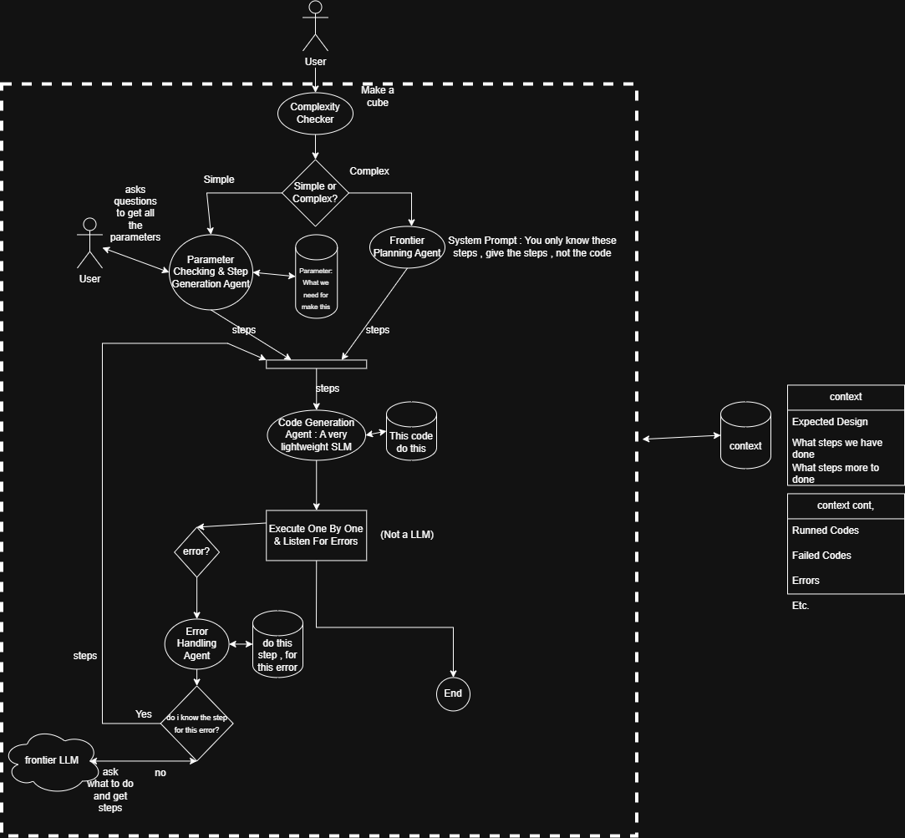

# FreeGen

A fully cloud-based, contract-driven multi-agent system for generative CAD. FreeGen leverages high-speed cloud LLMs (powered primarily by Groq and DeepSeek) for code generation, autonomous multi-agent orchestration, and a bounded self-healing loop to transform natural language and sketches into parametric FreeCAD models.

## Agent Flow

## How It Works: Multi-Agent Orchestration

FreeGen is designed to solve the core problem of generating complex CAD models by breaking down the task into a coordinated, multi-step workflow. Powered by cloud inference engines like Groq and DeepSeek, the system utilizes specialized agents that reason, plan, execute, and self-heal.

### 1. Multi-Step Workflow & Routing
The system is orchestrated by an **AgentRouter** that manages the transition between various autonomous states:
`COMPLEXITY_CHECK` → `PARAMETER_GATHERING` → `PLANNING` → `CODE_GENERATION` → `EXECUTION` → `ERROR_HANDLING`

The modular components and agents in the system include:
- **Supervisor Agent**: Performs a lightweight complexity check on user inputs to handle pathing and route requests through the appropriate pipeline.
- **Parameter Agent**: Extracts necessary geometric parameters and identifies missing constraints using cloud LLMs.
- **Planner Agent**: Breaks down complex shapes into logical construction steps.
- **Code Generator Agent**: Translates the plan and parameters into executable FreeCAD Python scripts using cloud AI models.
- **Code Executor (Hardcoded)**: A deterministic, hardcoded code execution service that directly interfaces with FreeCAD to execute scripts and evaluate runtime output.

### 2. Contextual Memory
The orchestrator maintains an **OrchestratorContext** (Global Session State) that acts as the memory for the system. It tracks the user prompt, extracted vs. missing parameters, generated code, previously run codes, and execution errors. This memory ensures that agents have the full context of what has been decided and what failed in previous steps.

### 3. Reasoning and Decision-Making
- **Complexity Check (Supervisor Agent)**: Performs a fast, simple complexity analysis to determine pathing—deciding whether a prompt requires full multi-step planning or a streamlined generation flow.
- **Parameter Gathering**: The Parameter Agent reasons about the user's request to identify explicit and implicit dimensions. If parameters are missing, it tracks them, preventing premature code generation.

### 4. Planning
For intricate designs, the **Planner Agent** steps in to decompose the instruction into logical step categories (e.g., base sketch, extrusion, boolean operations). This planning phase provides a structured blueprint that constrains the code generation, significantly improving reliability over single-prompt generation.

### 5. Action-Taking and Self-Healing
Once the code is generated, the hardcoded **Code Executor** takes action by running the Python script directly inside FreeCAD. 
Crucially, if the script fails during execution in FreeCAD, the system enters an **Error Handling** state. The execution errors and failed code are captured in context memory and fed back into the cloud models (Groq / DeepSeek). This creates a bounded self-healing loop where the AI agents autonomously debug and refine the script until execution succeeds (`COMPLETED` state).

---

## Documentation & Testing

For detailed instructions on setting up, running unit tests, and interactively testing the multi-agent backend APIs, see [How to Test Backend](docs/how-to-test-backend.md).
