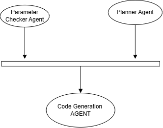

# Code Generator Agent

This agent translates step-by-step text instructions into executable FreeCAD Python macros.

## What it does
- The Code Generator Agent is responsible for writing the actual Python code in the FreeGen system.
- **Its main feature is to generate executable FreeCAD Python scripting code for a given CAD instruction step.**
- It ensures the generated code correctly matches the intended design step.
- It also finds and references relevant information from a knowledge base to help the model write better code.

## How it does it
- It runs a web server with a `/generate` endpoint to receive text instructions.
- It connects to a powerful coding language model (Qwen 2.5 Coder via Groq API).
- It retrieves helpful context from a specialized Retrieval-Augmented Generation (RAG) knowledge base.
- It sends the instruction and the context to the language model to write the FreeCAD macro.
- It strictly formats the response to ensure only executable code is produced.
- It returns the final Python code along with the sources it used for verification.

