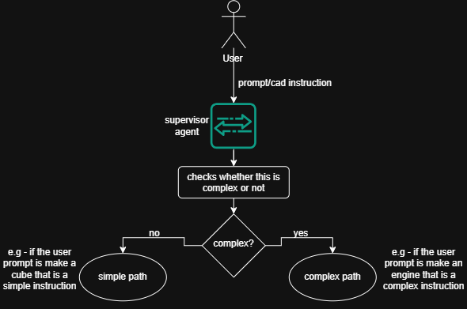

# Supervisor Agent

This agent acts as the main gateway for all incoming user requests.

## Why this agent?
- Complex instructions need a large language model to process correctly.
- Large models cost a lot of money to run.
- Sending a simple instruction to a large model is a waste of money.
- This agent filters out simple tasks to save money and run faster.

## What it does
- The Supervisor Agent is the very first step in the FreeGen system.
- **Its main feature is to evaluate the user's instruction and decide if it is simple or complex.**
- It checks if the user provided text, a sketch, or both.
- It helps route simple shape requests to a faster system.
- It sends harder requests or sketches to the advanced planning system.

## How it does it
- It runs a web server with an `/evaluate` endpoint.
- If the user only provides a sketch with no text, it instantly labels the task as complex.
- For text requests, it connects to a fast language model to make a decision.
- It asks the model to classify single basic shapes as simple.
- It asks the model to classify multi-part shapes or custom features as complex.
- It forces the model to return its final decision as structured JSON data.
- It safely defaults to the complex path if any errors happen during the evaluation.

